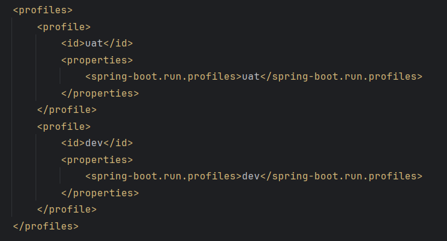

# SpringBootProfilesDemo
This is a demo project for the usage spring boot profiles and ways of implementing the profiles in our applications.

If we have config properties based on different environment then we have to use profiling.

We need to create different properties file based on profile and the naming convention should be application-profile1.properties

i.e, application-prod.properties

How to set the profiles:

we need to mention the active profile in parent properties file:
application.properties -> spring.profiles.active=dev

This will activate the current profile as dev and uses the value of dev.

Two Ways to run our spring boot application jar/war file through command:

1) While Application startup by using command:

   mvn spring-boot:run -Dspring-boot.run.profiles=prod

2) Adding Profile tag in the POM file:
    
    
    
    Here the value in the id tag will be used to mention the profile while running the application:
    
    mvn spring-boot:run -Puat
    mvn spring-boot:run -Pdev

@Profile annotation:
Using profile annotation we can tell spring boot to create a bean only when particular profile is set.

@Component
\
@Profile("dev")
\
public class MsSqlConnection{
\
//JDBC
\
}

-> This bean only invoked when the active profile is set to dev.